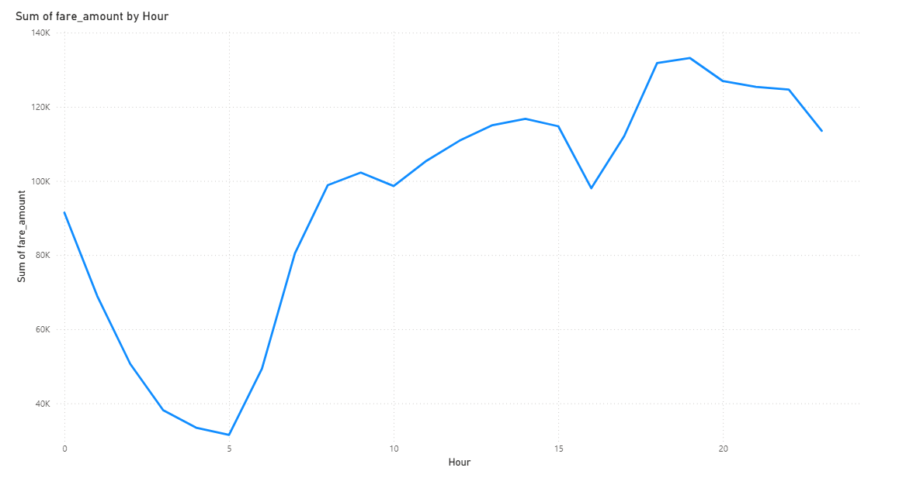
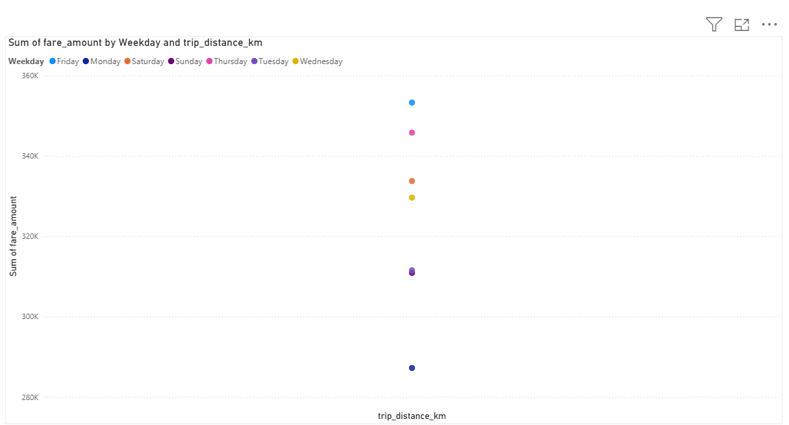
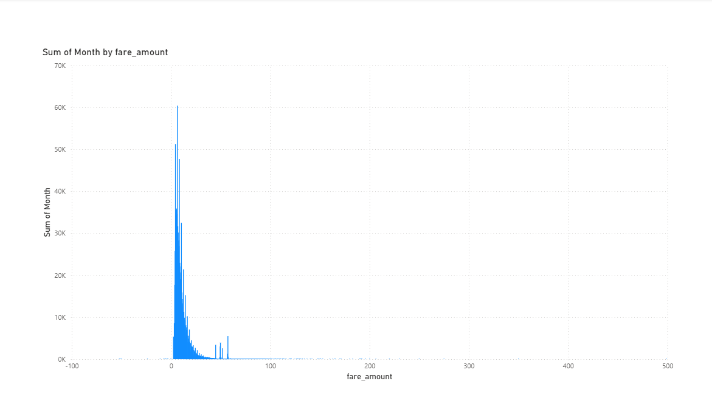
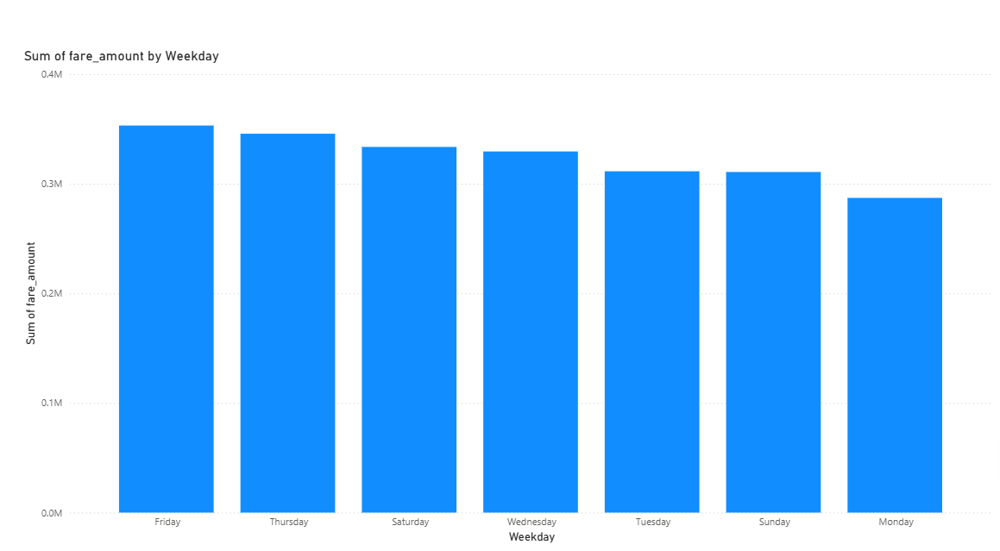
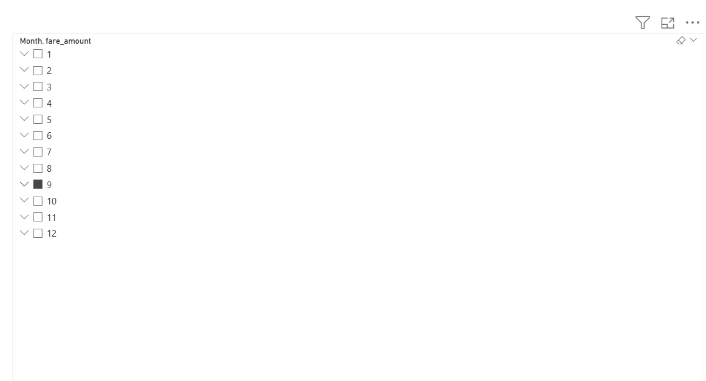
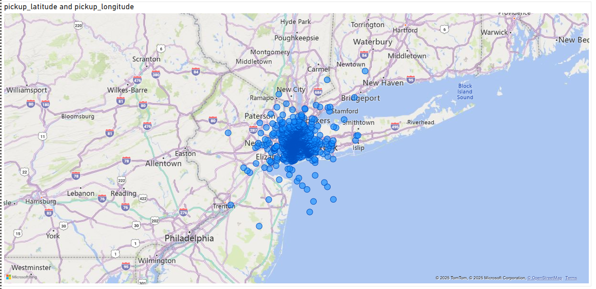
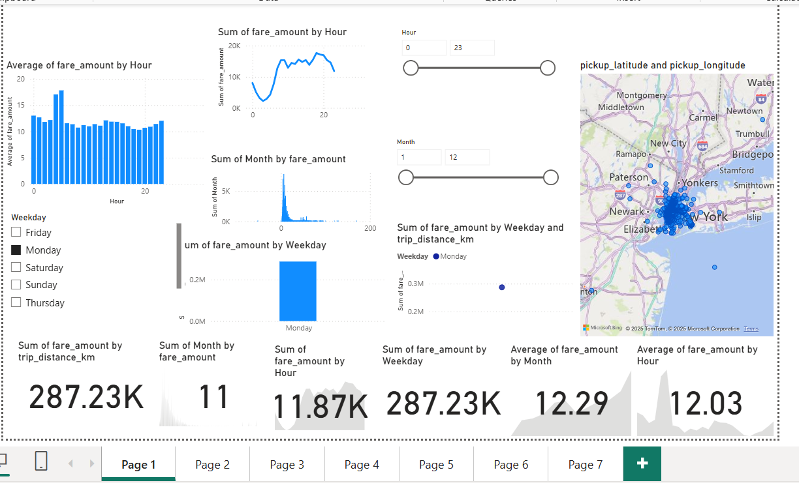

# uber-fare-analysis
# Power BI project analyzing Uber fares dataset
# NAMES: Cedrick Rukundo 
# ID 27946
# Group: E  
# Uber Fares Data Analysis Dashboard

---

##  Dashboard Visualizations

### 1. Hourly Fare Analysis
Shows how Uber fare amounts vary by hour of the day.  

### 2. Weekday Fare vs Distance
Analyzes fare amount by weekday and trip distance (km).  

### 3. Monthly Fare Analysis
Displays total fare amount collected by month.  

### 4. Fare by Weekday
Compares fare totals across different weekdays.  

### 5. Fare Trends by Month
Line chart or table showing fare amount over months.  

### 6. Pickup Location Map
Geographical map showing pickup coordinates.  

### 7.Dashboard over view

##  Key Findings

- Peak fare times occur around evening rush hours.
- Weekends show higher trip distances.
- Most rides are concentrated in specific pickup zones in New York.

---

##  Files Included

- uber_dashboard.pbix — Power BI dashboard file  
- uber_data_featured.csv — Cleaned dataset used for analysis  
- README.md — This file describing the project
